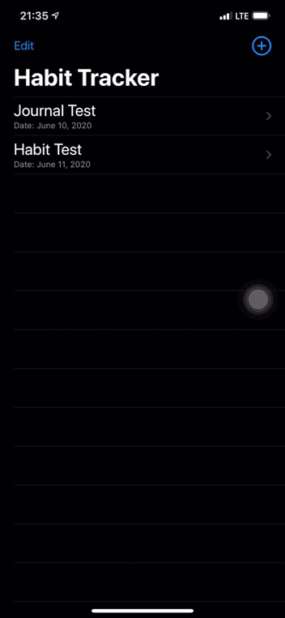

<h1> Day 47 of 100 Days of SwiftUI </h1> 
<h3> Habit Tracker App </h3> 

 The challenge is to build an app to track things that user did such as learning new languages, playing instruments and so on. 
  
For more detail about the challenge -> <a href="https://www.hackingwithswift.com/guide/ios-swiftui/4/3/challenge" target="_blank">Click Here!</a>
  
App demo:   

